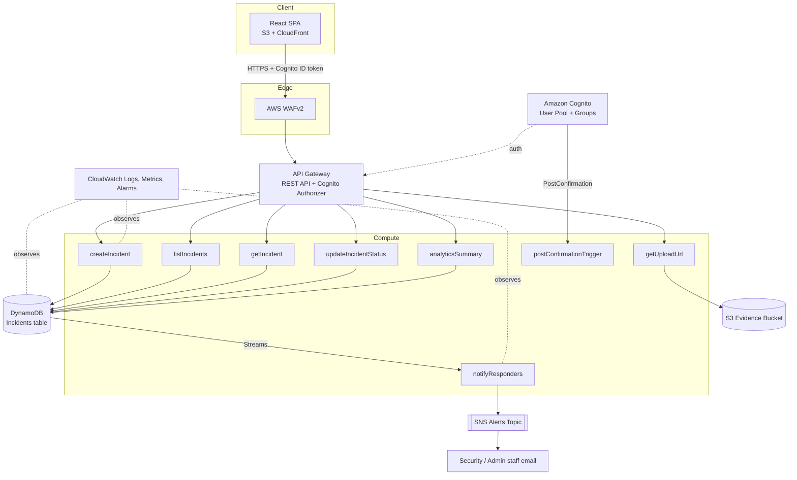

# Architecture



## Data model (DynamoDB single table: `incidents`)

| Attribute | Type | Notes |
|---|---|---|
| `incidentId` (PK) | String (UUID) | Primary key |
| `status` | String | reported / acknowledged / in_progress / resolved / closed |
| `reportedBy` | String | Cognito `sub` of the reporter |
| `createdAt` | ISO string | Sort key for all GSIs |
| `gsi1pk` | String | Constant `"INCIDENT"`, used for the time-ordered index |

GSIs:
- `StatusCreatedAtIndex` (status, createdAt) — dashboard filtering by status.
- `ReporterCreatedAtIndex` (reportedBy, createdAt) — "my reports" view for students/staff.
- `AllItemsCreatedAtIndex` (gsi1pk, createdAt) — time-bounded queries for analytics and the hotspot risk factor, without a full table scan.

## Risk scoring
Rule-based, explainable score (0-100) computed in [`backend/src/lib/riskScoring.js`](../backend/src/lib/riskScoring.js):

```
score = severity(1-5) * 15
      + categoryWeight (5-25 depending on category)
      + hotspotScore  (min(2 * incidents_at_same_building_last_30_days, 20))
      + nightBonus    (+10 if reported between 22:00-06:00 UTC)
```

Priority thresholds: `>=75 Critical`, `>=50 High`, `>=25 Medium`, else `Low`.

## Event-driven alerting
`createIncident` and `updateIncidentStatus` only write to DynamoDB. A DynamoDB
Stream triggers `notifyResponders`, which publishes to the SNS `AlertsTopic`
when a new incident is `High`/`Critical` priority, or when an incident's
status changes. This keeps the write path fast and decouples notification
delivery (SNS today; SES/SMS can be added without touching the write path).
